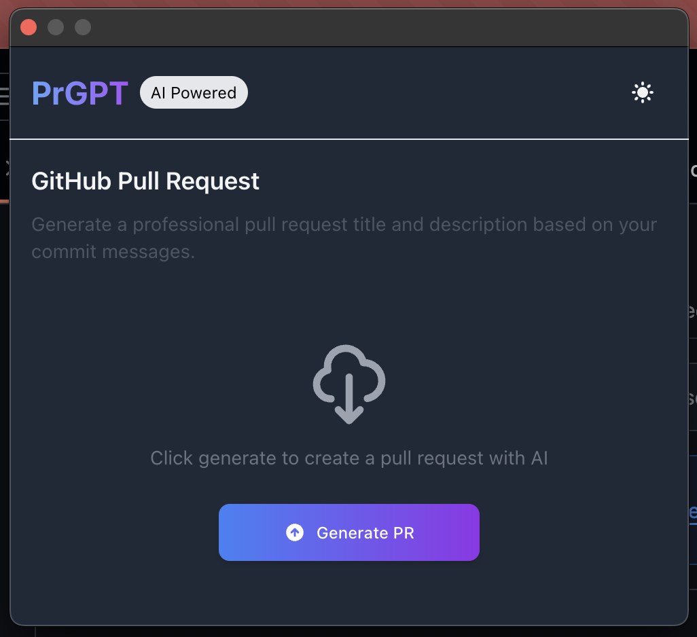

# PrGPT - AI Powered Pull Request Title and Description Generator

**PrGPT** is a web extension that automatically generates titles and descriptions for your GitHub Pull Requests with the help of AI. Built using the [Plasmo Framework](https://www.plasmo.com/), PrGPT integrates seamlessly into your workflow, helping you write better PRs faster.

## ✨ Features

- Detects when you're on a GitHub pull request creation page
- Generates smart, context-aware PR titles and descriptions
- Easy-to-use UI built with React and TailwindCSS
- Helpful guidance when not on a PR page
- Lightweight and blazing fast with Plasmo

<!--
## 📸 Preview

<div style="width: 100%; height: 400px; overflow: hidden;">
  
</div>
-->

## 📹 Demo

[](https://www.youtube.com/watch?v=BJMMA4f6jY4)

## 🛠️ Tech Stack

- [Plasmo Framework](https://www.plasmo.com/)
- [React](https://react.dev/)
- [Tailwind CSS](https://tailwindcss.com/)
- [OpenAI](https://openai.com/)

## 🚀 Getting Started

### 1. Clone the repo

```bash
git clone https://github.com/Muhsin-42/prgpt.git
cd prgpt
```

### 2. Install dependencies

```bash
pnpm install
```

_Or use `npm install` or `yarn install` if you prefer._

### 3. Run the extension locally

```bash
pnpm dev
```

### 4. Load into your browser

- Open your browser's extensions page
- Enable **Developer mode**
- Click **Load unpacked**
- Select the `.plasmo` build folder

## 📜 License

MIT License. See `LICENSE` for details.

---

## 🙌 Contributions

Contributions, issues, and feature requests are welcome!  
Feel free to open a pull request or submit an issue.
